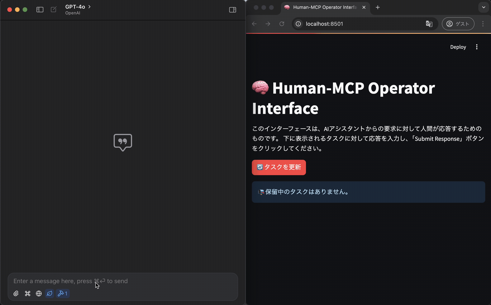
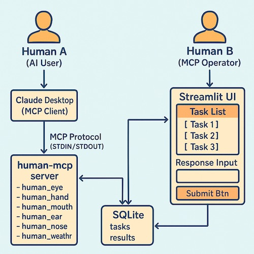

# human-mcp

人間をMCPツールとして提供するMCPサーバー




## 概要



human-mcpは、AIアシスタントが人間の能力を活用できるようにするMCPサーバーです。AIアシスタントからのリクエストを受け取り、人間に指示を表示し、人間からの応答をAIアシスタントに返します。

主な機能：
- MCPクライアントからのツール実行リクエスト (STDIN経由) を受け付ける
- 実行に必要な指示をSQLiteデータベースに書き込む
- StreamlitアプリケーションがSQLiteを監視し、人間に指示を表示、応答入力を促す
- 人間がStreamlit経由で入力した結果をSQLiteに書き込む
- MCPサーバーがSQLiteから結果を読み取り、MCPレスポンスとしてクライアント (STDOUT経由) に返す

## 提供するツール

1. **human_eye_tool**: 人間が目で見て状況を説明したり、特定のものを探したりします。
2. **human_hand_tool**: 人間が手を使って簡単な物理的操作を実行します。
3. **human_mouth_tool**: 人間が口を使って指定された言葉を発話します。
4. **human_weather_tool**: 人間が現在地の天気を確認して報告します。
5. **human_ear_tool**: 人間が耳を使って音を聞き、状況を説明します。
6. **human_nose_tool**: 人間が鼻を使って匂いを確認します。
7. **human_taste_tool**: 人間が口を使って食べ物を味わい、その味を説明します。


## セットアップ

### 前提条件

- Python 3.12以上
- uv
- SQLite3

### インストール手順

1. リポジトリをクローン
   ```bash
   git clone https://github.com/yourusername/human-mcp.git
   cd human-mcp
   ```

2. 仮想環境を作成して有効化
   ```bash
   uv venv
   source .venv/bin/activate
   ```

3. 依存関係をインストール
   ```bash
   uv pip install .
   ```

## 使用方法

0. MCPサーバーをインストール
  ```bash
  task install-mcp
  ```

1. ClaudeからMCPサーバーに接続
   ```json
   "human-mcp": {
     "command": "uv",
     "args": [
       "run",
       "--with",
       "mcp[cli]",
       "mcp",
       "run",
       "$PATH_TO_REPOSITORY/human_mcp/mcp_server.py"
     ]
   }
   ```

3. 2つ目のターミナルでStreamlit UIを起動
   ```bash
   task run-streamlit
   ```

4. ブラウザで表示されるStreamlit UIにアクセス（通常は http://localhost:8501 ）

5. MCPクライアント（例：Claude Desktop）からリクエストを送信すると、Streamlit UIにタスクが表示されます。

6. Streamlit UIで応答を入力し、「応答を送信」ボタンをクリックすると、その応答がMCPクライアントに返されます。

## プロジェクト構造

```
human-mcp/
├── human_mcp/              # メインのPythonパッケージ
│   ├── __init__.py         # パッケージマーカー
│   ├── db_utils.py         # SQLite関連ユーティリティ
│   ├── tools.py            # ツール定義
│   ├── mcp_server.py       # MCPサーバー本体
│   └── streamlit_app.py    # Streamlit UI アプリ
├── human_tasks.db          # SQLite データベースファイル (実行時に生成)
├── pyproject.toml          # プロジェクト設定、依存関係
└── README.md               # このファイル
```

## ライセンス

MIT

## 注意事項

このプロジェクトはジョーク用途を想定しています。実際の運用では、人間のオペレーターの負担や、応答の遅延などを考慮する必要があります。
